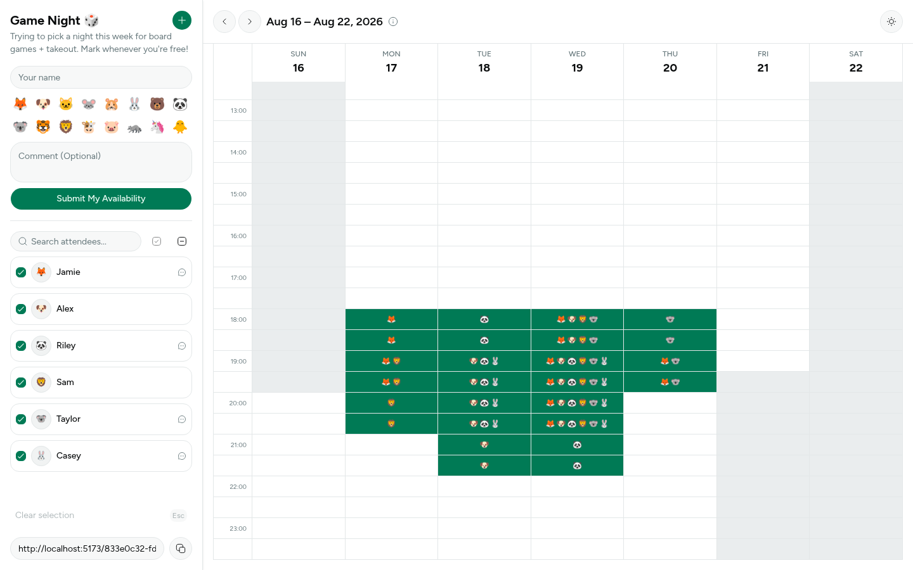

# ⏱️ Clockwork

A When2meet-style scheduling tool. A host creates an event with a date range, shares the link, and attendees mark the time slots they're available for. Everyone can see the combined availability at a glance.

## Philosophy

Clockwork is meant to be a simple, modern way to figure out a time that works. Nothing more. It stays away from piling on extra features that get in the way when all
you want to do is pick a time.

It also doesn't store any private information. There's no user accounts and nothing to log
into. This keeps the server nice and slim, since it never has to deal with credentials or identities.

**Why Rust Backend?**

No particular reason. Just want to get my hands on the language 😆

## How it works

1. A host creates an event (name, description, and an allowed date range).
2. The host shares the event link with attendees.
3. Each attendee submits a name, an emoji, an optional comment, and the time slots they're
   free. After submission there is an option to edit or delete their own response, without needing an account.
4. Everyone viewing the event sees every attendee's availability overlaid on one grid.
5. Events past their end date are periodically swept and removed by a background cleanup job.

## Screenshots



## Running with Docker Compose

This is the easiest way to run the full stack:

```bash
cp .env.example .env
# edit .env if you're not running on localhost
docker compose up --build
```

- Web UI: http://localhost:8080
- API: http://localhost:3000

`API_BASE_URL` and `WEB_BASE_URL` in `.env` must be URLs reachable from the _browser_, since
`API_BASE_URL` is baked into the frontend bundle at build time and `WEB_BASE_URL` is used as
the API's CORS `ALLOW_ORIGIN`. See `.env.example` for details.

## Running locally

### API (`api/`)

Requires Rust and `sqlite3`.

```bash
cd api
cp .example.env .env   # adjust DATABASE_URL / ALLOW_ORIGIN as needed
cargo run
```

Migrations in `api/migrations` run automatically on startup. The API listens on port `3000`.

Key environment variables:

| Variable                      | Description                        | Default              |
| ----------------------------- | ---------------------------------- | -------------------- |
| `DATABASE_URL`                | SQLite connection string           | — (required)         |
| `ALLOW_ORIGIN`                | Origin allowed via CORS            | none (CORS disabled) |
| `EVENT_CLEANUP_INTERVAL_SECS` | How often expired events are swept | `3600`               |

### Web (`web/`)

Requires Node.js and `pnpm`.

```bash
cd web
cp example.env .env   # set VITE_API_BASE_URL if the API isn't on localhost:3000
pnpm install
pnpm dev
```

Other useful scripts: `pnpm build`, `pnpm lint`, `pnpm format`, `pnpm typecheck`.

## API

The HTTP API is documented in [`api/openapi.yaml`](api/openapi.yaml). Endpoints:

| Method   | Path                                         | Description                                    |
| -------- | -------------------------------------------- | ---------------------------------------------- |
| `POST`   | `/events`                                    | Create an event                                |
| `GET`    | `/events/{event_id}`                         | Get an event with all attendees and time slots |
| `POST`   | `/events/{event_id}/time-slots`              | Submit an attendee's availability              |
| `PUT`    | `/events/{event_id}/attendees/{attendee_id}` | Edit an attendee's submission                  |
| `DELETE` | `/events/{event_id}/attendees/{attendee_id}` | Delete an attendee's submission                |

Editing or deleting a submission requires the submission token issued when it was created.

## Testing

Browser end-to-end tests (Playwright) live in `e2e/`:

```bash
cd e2e
pnpm install
pnpm exec playwright install chromium   # first run only
pnpm test
```

This boots a real API (against a scratch SQLite DB) and the web dev server
itself, so no separate setup is needed.

## Tech stack

- **API**: Rust, Axum, SQLx (SQLite), Tokio
- **Web**: React 19, TypeScript, Vite, Tailwind CSS, shadcn/ui, React Router
- **Deployment**: Docker Compose, Caddy (serving the built web app)

## AI usage disclosure

This project is created by a human, who is also responsible for its high-level design. AI is used as a coding agent to help implement that design as well as writing documents, and all AI-generated code is reviewed by a human before being accepted.
